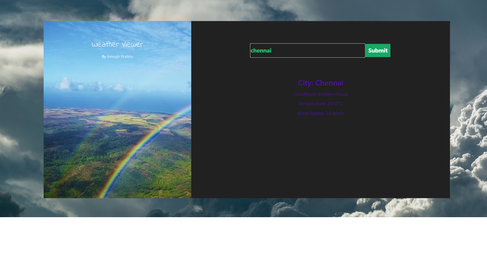

# ☀️🌤⛈❄️ A weather web application using Html, Css, Javascript, Weathermap Api

The API provider: http://www.OpenWeatherMap.org
# Weather Information Display



This project is a simple weather information display that retrieves and presents real-time weather data for a specific city using the OpenWeatherMap API. It allows users to input a city name, fetches weather data, and displays details such as temperature, weather conditions, and wind speed on a webpage.

## Table of Contents

- [Features](#features)
- [Demo](#demo)
- [Getting Started](#getting-started)
  - [Prerequisites](#prerequisites)
  - [Installation](#installation)
- [Usage](#usage)
- [Technologies Used](#technologies-used)
- [Future Enhancements](#future-enhancements)
- [Contributing](#contributing)
- [License](#license)

## Features

- User-friendly interface with an input field and a button to retrieve weather data.
- Real-time weather information, including temperature in Celsius, weather description, and wind speed in km/h.
- Conversion of temperature from Kelvin to Celsius for accurate representation.
- Error handling for incorrect city names or network issues.
- Clean and responsive design for a seamless user experience.

## Demo

You can view a live demo of the Weather Information Display [here](https://your-demo-link.com).

## Getting Started

### Prerequisites

Before you begin, ensure you have met the following requirements:

- You have a modern web browser installed.
- You have signed up for a free API key from [OpenWeatherMap](https://www.openweathermap.org/appid).

### Installation

1. Clone the repository:

   ```sh
   git clone https://github.com/your-username/weather-information-display.git
